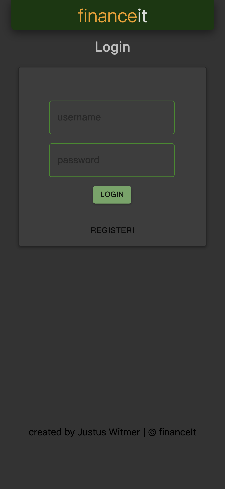

# financeIt 

## Description

_Duration:_ Two Weeks

This is a full CRUD budgeting app. The user can enter transactions, categorize them, edit or delete them and view them according to date, either as a summary or in detail.

This app utilizes the "full stack" beginning with a React-powered front end, Redux, Express, Passport, node.js, and a PostgreSQL daatabase (a full list of dependencies can be found in `package.json`).


## Screenshots

]
]
]
]
]
]

## Prerequisites

Before you get started, make sure you have the following software installed on your computer:

- [Node.js](https://nodejs.org/en/)
- [PostrgeSQL](https://www.postgresql.org/)
- [Nodemon](https://nodemon.io/)

## Create database and table

Follow instructions in `database.sql`.
There is sample data in there as well.

## Development Setup Instructions

- Run `npm install`
- Create a `.env` file at the root of the project and paste this line into the file:
  ```
  SERVER_SESSION_SECRET=superDuperSecret
  ```
  While you're in your new `.env` file, take the time to replace `superDuperSecret` with some long random string like `25POUbVtx6RKVNWszd9ERB9Bb6` to keep your application secure. Here's a site that can help you: [https://passwordsgenerator.net/](https://passwordsgenerator.net/). If you don't do this step, create a secret with less than eight characters, or leave it as `superDuperSecret`, you will get a warning.
- Start postgres if not running already by using `brew services start postgresql`
- Run `npm run server`
- Run `npm run client`
- Navigate to `localhost:3000`

## Layout

- The Summary page summarizes what has been spent for the current month you are in and shows it first in one lump sum and then for each category. You can also select custom dates to view summary details.
- The Categories page lists out all the categories you have set up.
Clicking _Edit Categoreis_ will take you to a page where you can eidt
or delete each category. Keep in mind that you cannot edit a category
that has transactions tied too it.
- The Transactions page lists out all the transactions details for the month you are in. You can edit or delete each one. You can also add a transaction or select custom dates to view your transactions.
- The account page contains the logout button currently. Some added features that are still in the works would be to give the ability to change your passwors, bulk upload transactions, or link your financial institution to the app and automatically import transactions.

## Usage
- Register as a new user.
- Navigate to the Categories page and begin adding categories and specifying the monthly amount you want for each category.
- Add transactions in the Transactions page.
- View a summary of what you have spent in the Summary page.